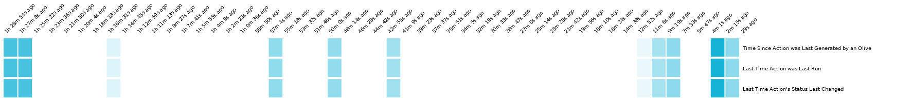

# Training Guide for Operators
This is a guide for operators who need to check whether Shesmu is healthy and
investigate failures.

## Pages
The main pages operators are going to use are:

- _Status_:
    - Check for server uptime
    - Check server version
    - Use the _STOP ALL ACTIONS_ emergency override
- _Alerts_ (in conjunction with Prometheus Alert Manager):
    - Explore and find patterns in alerts
    - Display permalinks to alerts
    - Alerts _cannot_ be silenced here; use the Prometheus Alert Manager dashboard
- _Actions_:
    - Use the _Pipeline Lead Dashboard_ to monitor server state
    - Find related actions across olives (_e.g._, search by run)
    - Do maintenance on actions (_e.g._, skip and rerun)
- _Olives_:
    - Find actions related to an olive
    - Do maintenance on actions (_e.g._, skip and rerun)
    - Investigate dataflow problems (_e.g._, missing records)

## Using Filters Effectively
On both the _Olives_ and _Actions_ page, you can add filters to narrow the
list. There are a few kinds of filters:

- action IDs
- action types
- source olives (only on _Actions_ page)
- status
- text and regular expressions matches
- time ranges and time horizons

Text and regular expression searches are much slower than the other filter. Try
to use tags where possible and add tags to olives for better searching. When
possibly try to combine text searches with other faster searches to improve
performance. Using the _Olives_ page for is also faster because it narrows the
search to a single olive's output.

On the _Overview_ tab, there is a breakdown of actions (this applies even on
the _Olives_ page where the filters are under the _Actions_ tab). By clicking
on any cell header or cell in the tables, the search can be restricted using
the _Drill Down_ menu item.

For the histograms, clicking and dragging will filter on that range. Histograms
can provide a lot of useful information about what is going on in an olive. For
instance:

In this histogram there are a number of actions that haven not been generated
by an olive recently. This likely means that the input data changed and these
actions are now orphans and may be candidates to be purged. The larger the gap
between now and the last time they were generated, the more likely it is that
they are not being generated. The _Olives_ page would show when this olive last
ran for comparison.

_Exercise:_ Go to the _Actions_ page, find an action, and open it in a new tab.
Using the _Actions_ and _Olives_ page, find 3 different filter combinations
that find this action using the information displayed about it.

## Custom Searches
When you build up a search query using filters on the _Actions_ page, it can be
saved using the _Add to My Searches_ button. This search will now be available
from your browser for this server.

If you want to share a search click on the _Export Search_ button. If the
search is exported to a file, it can be added to the server's configuration to
make available to all users. The _To Clipboard_, _To Clipboard for Ticket_, and
_To File_ are all useful for importing the search later. There are also buttons
to create purge or fetch shell commands, for use in scripts. The JIRA plugin
also allows exporting searches to tickets; more details on that in the next
section.

## Saved Searches
Shesmu's _Actions_ dashboard provides a way to sift through the actions that
olives have generated. It can be useful to save these searches. By clicking the
_Save Search_, the search will be saved in the browser. They can be shared by
clicking the clipboard icon beside a saved search to copy the search and then
using the _Add Search_ button on the dashboard and pasting in the text
copied. The _Import Searches_ and _Export Searches_ can also be used to copy
all searches and upload them to a different instance.

To go beyond person-to-person sharing, the search filter JSON, created by
either clicking the _Show Search_ button, can be saved to a file ending in
`.search` in the Shesmu configuration directory. The name of the file will be
used as the name of the search.

It is not recommended to save searches that reference a particular olive source
location. Every time the file is updated, the olive's hash will be updated and
the filter will no longer match. The `hash` property in the filter can be
changed to `null` to avoid this issue. Even if this were not the case, it is
possible that the olive will move around in the script and the line and column
that mark the start of each olive will change.

## Understanding Delegation
Shesmu can use JIRA and custom searches to create delegation. A JIRA ticket can
contain a search in text form (_i.e._, `shesmusearch:`) or references to
particular actions (_i.e._, `shesmu:`) in the description.

In the JIRA configuration, we have JIRA queries as follows:

    "searches": [
      {
        "filter": {
          "states": [
            "FAILED",
            "UNKNOWN",
            "HALP"
          ],
          "type": "status"
        },
        "jql": "project IN (\"GC\", \"GDI\", \"GP\", \"GBS\", \"GRD\") AND resolution = Unresolved",
        "name": "Problems from {key} - {summary} ({assignee})",
        "type": "EACH_AND"
      },
      {
        "filter": {
          "states": [
            "FAILED",
            "UNKNOWN",
            "HALP"
            ],
          "type": "status"
        },
        "jql": "project IN (\"GC\", \"GDI\", \"GP\", \"GBS\", \"GRD\") AND resolution = Unresolved",
        "name": "Problems for {assignee}",
        "type": "BY_ASSIGNEE"
      },
      {
        "filter": {
          "states": [
            "FAILED",
            "UNKNOWN",
            "HALP"
          ],
          "type": "status"
        },
        "jql": "project IN (\"GC\", \"GDI\", \"GP\", \"GBS\", \"GRD\") AND resolution = Unresolved",
        "name": "Pipeline Lead Dashboard",
        "type": "ALL_EXCEPT"
      },
      {
        "filter": {
          "states": [
            "FAILED",
            "UNKNOWN",
            "HALP"
          ],
          "type": "status"
        },
        "jql": "project IN (\"GC\", \"GDI\", \"GP\", \"GBS\", \"GRD\") AND resolution = Unresolved",
        "name": "Problems Currently Handed-Off",
        "type": "ALL_AND"
      }
    ],

Each of these searches performs a JIRA search using `"jql"` to find searches
embedded in issues and then takes the Shesmu search in `"filter"` and combines
them using `"type"`. So, the `EACH_AND` type takes every ticket and creates a
search for it by combining the query in this file with the query from the
ticket. `BY_ASSIGNEE` does the same thing, but first grouping by ticket
assignee. The `ALL_EXCEPT` search is the most important for operations. It
creates a dashboard that has all the problems except for ones mentioned in
tickets. Therefore, operations can carve off problems and delegate them to
other people by creating at ticket.

Tickets can be made by using the filters and then exporting the problem to a
new ticket. It does not need to be assigned to be removed from the _Pipeline
Lead Dashboard_. This allows the _Pipeline Lead Dashboard_ to act as the
operations inbox.

The page has to be refreshed to get the updated query from JIRA and the results
from JIRA are cached for 15 minutes.

_Exercise:_ Find a problem using the _Pipeline Lead Dashboard_ and create a
ticket for it.

To create a new ticket:

1. Use the _Actions_ page to search the set of actions you want.
2. Switch back to the _All Actions_ search; otherwise the search will include the _Pipeline Lead Dashboard_ as a base.
3. Click _Export Search_ and click _File Bug in GC_ or _File Bug in GDI_.
4. You should be directed to a JIRA create issue page. Fill in the remaining details.

If there is already a ticket that you would like to attach the search to:

1. Use the _Actions_ page to search the set of actions you want.
2. Switch back to the _All Actions_ search; otherwise the search will include the _Pipeline Lead Dashboard_ as a base.
3. Click _Export Search_ and click _Copy to Clipboard for Ticket_.
4. Open the issue and edit the description.
5. Paste the search filter on a separate line in the ticket.

Once a ticket is filed, refresh the _Actions_ page and there will be a search
for each ticket with an embedded search and an aggregated search of every user.
Shesmu caches this information for 15 minutes, so the searches may not be
updated immediately.

It is also possible to extract the search from a ticket manually.

1. Go to the _Actions_ page.
2. Click _Import Search_ in the top left.
3. Paste the `shesmusearch:` string into the box.
4. Enter a descriptive name for this search.
5. Click _Add to My Searches_.

This search will be visible in the drop down list only for you from this
browser for this Shesmu server. If you wish to share it for everyone, use
_Export Search_ and then _To File_ and install it in the Shesmu configuration
directory.

## Throttlers and Schedules
Shesmu will stop running olives or checking on an action if there is a
potential overload. On the main page, _STOP STOP STOP_ will cause all active
actions to slip into a `THROTTLED` state.

There are 3 kinds of throttles supported:

- per plugin/service throttles
- per data format throttles
- custom throttles

Per plugin/service throttles can stop a plugin and all the actions and olives
that use it. For instance, throttling `jira` will stop any olives that are
using the JIRA searches or any actions that file JIRA issues.

Every data format (_e.g._, `cerberus_fp`) can also be throttled and olives that
use this data will not run.

To engage a throttle, there are several ways:

- using a maintenance schedule: a file named _throttle_`.maintenance` contains a list of times to engage a throttle. These are useful for planned events, such as IT maintenance. There's a graphical [maintenance schedule editor](maintenance-editor).
- [token bucket throttling](plugin-ratelimit.md): used to slow down access to services that overload easily. I'm looking at you, JIRA.
- Prometheus Alerts: used to throttle based on external conditions

Prometheus is the most flexible of the system. Prometheus rules monitor systems
and can stop Shesmu from accessing certain systems by firing `AutoInhibit`
alerts. Since it is useful to create these manually,
[Somnus](https://github.com/oicr-gsi/somnus) can be used to manually create
limited-time inhibitions. Think of them as the reverse of a silence; stop the
problem for a limited window instead of ignoring it for a limited.

Typically, actions in a `THROTTLED` state don't require any action. If an
action has been throttled for a very long time it may indicate that another
service is broken or stuck or a maintenance schedule is overwhelmed. It's
usually best to check Prometheus for inhibition alerts.

### Olive and Script Pauses
While fun, _STOP STOP STOP_ is a blunt tool for stopping actions.  Actions can
also be paused using the olives that generate them. On the _Olives_ page, it is
possible to pause the actions generated by an olive or a file.  Pausing an
olive does not stop the olive from running. It simply puts all actions
generated by the olive into a `THROTTLED` state.

Pauses can be created or removed from the _Olives_ page and removed on the
_Pauses_ page. The reason for having them in two places is this:

1. You find a bug in an olive and pause that olive to stop making a mess.
2. You fix the olive and replace the file on the Shesmu server.
3. The new olive replaces the old olive and generates actions. Some of the
   actions are different but some are the same.
4. The modified olive is unpaused so the new actions run, but the overlapping
	 actions are still paused. The button to pause and unpause the olive is no
   longer on the _Olives_ page.

To avoid this problem, all pauses, even for olives that have been replaced are
available on the _Pauses_ page and they can be cleared from there.

## Action Maintenance
Every Shesmu action has:

- a state
- a last generation time (a.k.a. `added`)
- a last checked time (a.k.a. `checked`)
- a last state transition time (a.k.a. `statusChanged`)
- an external modification time (a.k.a. `external`; optional)

Every few minutes, Shesmu runs all the olives and they generate all the
actions. Since most actions are the same every time, the duplicates are thrown
away. The _last generation time_ is the last time an olive produced this
action. If the action is a duplicate, it will still have an updated generation
time.

Once an action has been generated by an olive, it will enter an `UNKNOWN` state
and the Shesmu scheduler will try to run the action. Every time it does, it
will update the _last checked time_. When the action is checked, it can change
its state; if this occurs, _last state transition time_ is also updated.

Therefore, an old last generation time means the olive has stopped producing
this action, the olive has been deleted, or the olive is stuck. An old last
checked time indicates the Shesmu scheduler is overloaded or the action is not
requesting frequent updates. An old last transition time indicates that the
problem is internal to the action.

The _external modification time_ is some time that the action self-reports that
it thinks is useful. For Vidarr workflows, this is the last
modification time of the workflow run. JIRA actions show the last modification
time of the ticket they are associated with.

Actions also have _commands_ that allow you to tell the action to do something.
Commands will cause an action to flip back to the `UNKNOWN` state. Some
commands can be applied in bulk. A command may require a confirmation before
executing and some dangerous commands require a puzzle to be solved before
working in bulk.

| State | Description |
|-------|-------------|
| `FAILED` | The action has been attempted and encounter an error (possibly recoverable). |
| `HALP` | The action is in a state where it needs human attention or intervention to correct itself. |
| `INFLIGHT` | The action is currently being executed. |
| `QUEUED` | The action is waiting for a remote system to start it. |
| `SAFETY_LIMIT_REACHED` | The action has encountered some user-defined limit stopping it from proceeding. |
| `SUCCEEDED` | The action is complete. |
| `THROTTLED` | The action is being rate limited by a Shesmu throttler or by an over-capacity signal. |
| `UNKNOWN` | The actions state is not currently known either due to an exception or not having been attempted. |
| `WAITING` | The action cannot be started due to a resource being unavailable. |
| `ZOMBIE` | The action is never going to complete. This is not necessarily a failed state; testing or debugging actions should be in this state. |

### SFTP Delete Actions
Files can be deleted from disk by the SFTP delete action. To have a human
review before deleting, the olive can set `automatic = False` and then a
command will be available for a human to approve the action. These actions
appear in the `HALP` state until they are approved.

### Vidarr Actions
Vidarr actions have several important commands meant to replace access to the
command line:

- Delete and Purge: This will delete a workflow run that has failed or not
  started. It will also remove the action.
- Reattempt Failed Workflow: Re-try a workflow run that has failed or not
  started.  If the parameters from the olive are different from the previous
	attempt, the olive's parameters will be used.
- Search Vidarr Again: Shesmu will scan Vidarr for a matching workflow runs to
  find a match. If the workflow is succeeded, it will never check again. This
	action triggers a rescan and is useful if workflow runs have been unloaded.

The Vidarr actions also generates some useful tags:
- `vidarr-target:`_name_: The _target_ on the Vidarr instance.
- `vidarr-workflow:`_name_[`/`_version_`]: The workflow that this action will
  run, both with and without the version.
- `vidarr-state:`[`active`|`attempt`|`conflict`|`dead`|`finished`|`missing`]:
	The action uses a state machine while its communicating with Vidarr. This is
  the current state of that machine.
- `vidarr-attempt:`_count_`: The number of times this workflow run has been
  attempted.

Vidarr actions have a few states they can be in:

- `FAILED` -- This can happen for a few reasons: the workflow itself failed,
	Vidarr rejected the submission request, an internal error occurred tying to
  launch the workflow.
- `HALP` -- The workflow run has been previously run, but with incompatible
	LIMS key versions. Correct LIMS or reprocess the workflow.
- `QUEUED` -- The workflow is waiting to start the next phase.
- `INFLIGHT` -- The workflow is running.
- `WAITING` -- The workflow run is in between Vidarr phases.
- `ZOMBIE` -- the workflow has input which is stale; normal procedures for
  fixing stale records will eventually generate a non-stale version of this
  action.

## Static Actions
Due to the imperfect nature of reality, it might be useful to launch bespoke
actions not defined by olives. To do this, create a JSON file that ends in
[`.actnow`](actnow.md).

Shesmu will add these actions to its queue and attempt to run them as if they
were produced by an olive.
